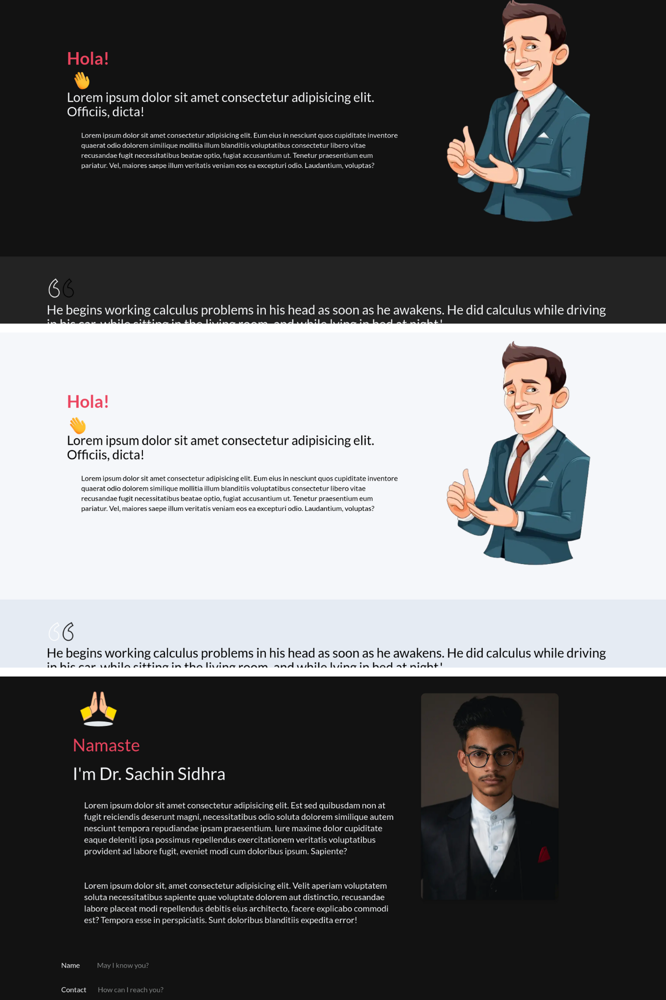
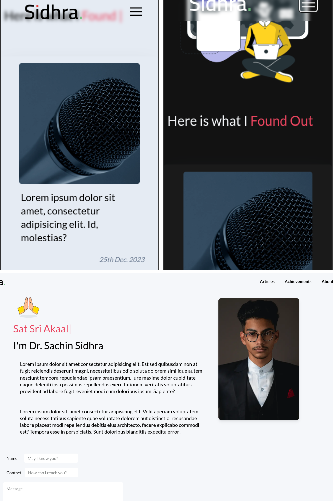

# Simple Portfolio Site for ... (My teacher)

This is a simple portfolio site for my teacher. It is a static site built with Next.js and Tailwind CSS. The site is hosted on Vercel.

## Features

- Responsive design
- Dark mode
- Static site generation
- Contact form [email reception loadng...]
- SEO friendly

## Screenshots

<div>
    
    
</div>

## Tech Stack

<ul>
    <li> </li>
    <li> </li>
    <li> </li>
  
    
<ul>

## Getting Started

- Clone the repository

```bash
git clone https://github.com/FayeKelmith/DrSachin.git

cd DrSachin

npm install

npm run dev

```

- Open [http://localhost:3000](http://localhost:3000) with your browser to see the result.

Or visit the live site [here](https://sidhra.vercel.app/)

> Note: Updates are loading
